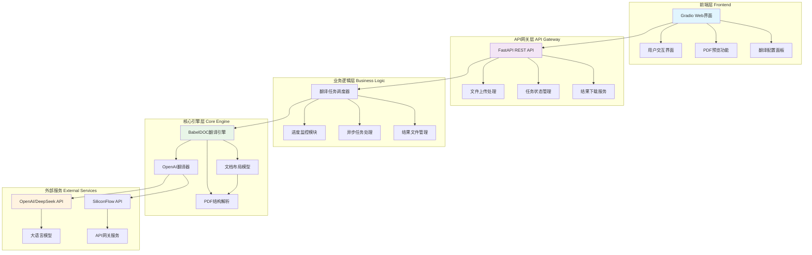
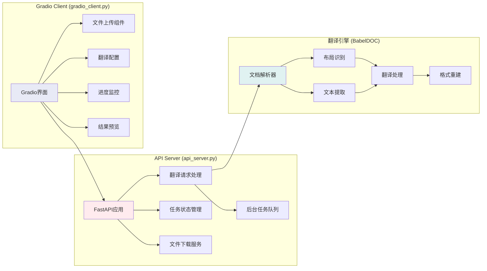
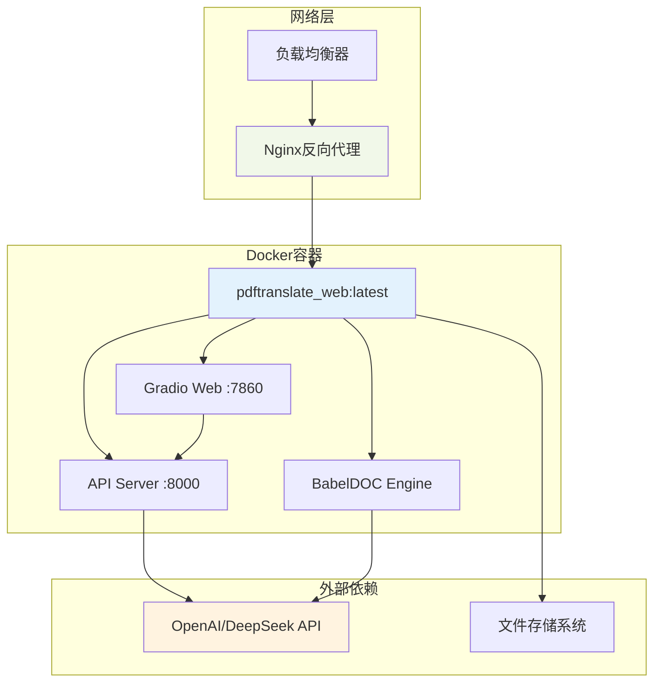
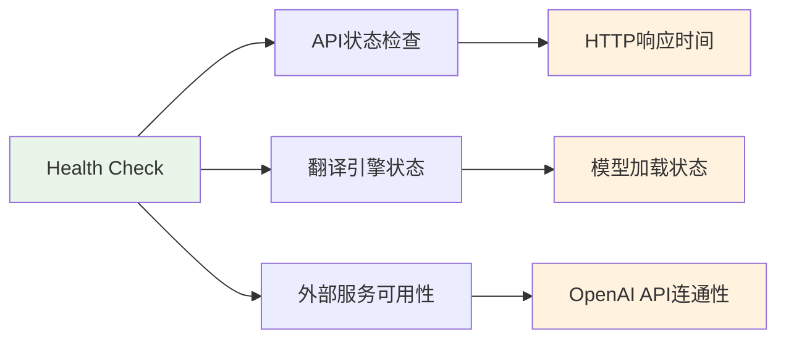
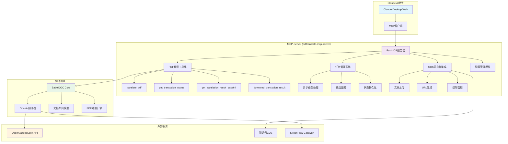

# PDF翻译Web应用技术报告

## 项目概述

### 项目背景

PDF翻译Web应用是一个基于AI的智能文档翻译系统，旨在解决跨语言文档交流的痛点。该项目基于BabelDOC翻译引擎，提供了完整的Web服务架构，支持PDF文档的智能翻译，并能保持原始文档的格式和布局不变。

该系统主要解决以下问题：
- **文档格式保持**：传统翻译工具往往破坏PDF原有格式，本系统完全保持文档结构
- **批量处理能力**：支持大规模PDF文档的自动化翻译处理
- **多语言支持**：基于大语言模型，支持多种语言间的高质量翻译
- **用户友好界面**：提供直观的Web界面和强大的API接口

## 系统架构设计

### 总体架构图



### 核心组件架构



## 核心技术实现

### 1. API服务器设计 (api_server.py)

#### 主要功能模块

**配置管理系统**
```python
def load_config():
    """从环境变量加载配置"""
    return {
        "openai": {
            "api_key": os.getenv("OPENAI_API_KEY", ""),
            "model": os.getenv("OPENAI_MODEL", "Qwen3-30B-A3B-Instruct-2507"),
            "base_url": os.getenv("OPENAI_BASE_URL", "https://ai.gitee.com/v1")
        },
        "server": {
            "host": os.getenv("SERVER_HOST", "0.0.0.0"),
            "port": int(os.getenv("SERVER_PORT", "8000")),
            "qps": int(os.getenv("QPS", "4"))
        }
    }
```

**异步翻译处理**
- 基于FastAPI的背景任务机制
- 支持实时进度跟踪
- 异步事件流处理
- 错误恢复和状态管理

**RESTful API设计**
- `POST /translate` - 提交翻译任务
- `GET /status/{task_id}` - 查询翻译状态
- `GET /download/{task_id}/{file_type}` - 下载翻译结果
- `GET /health` - 健康检查

#### 技术特点

1. **异步任务处理**：使用FastAPI的BackgroundTasks实现非阻塞翻译
2. **进度实时跟踪**：通过异步生成器提供实时进度更新
3. **状态持久化**：内存中维护任务状态，支持断点续传
4. **文件管理**：临时文件自动管理和清理机制

### 2. Web界面设计 (gradio_client.py)

#### 界面架构

**响应式布局设计**
- 采用Gradio的现代化组件系统
- 支持文件拖拽上传
- 实时PDF预览功能
- 翻译进度可视化

**核心功能实现**

```python
class GradioClient:
    def __init__(self, server_url: str = "http://localhost:8000"):
        self.client = BabelDOCClient(server_url)
        self.temp_dir = Path(tempfile.mkdtemp())
        self.current_task_id = None
```

**PDF预览系统**
```python
def pdf_to_images(self, pdf_path: str, max_pages: int = 5) -> list:
    """将PDF转换为图片预览"""
    doc = fitz.open(pdf_path)
    images = []
    for page_num in range(min(len(doc), max_pages)):
        page = doc[page_num]
        mat = fitz.Matrix(1.5, 1.5)  # 缩放比例
        pix = page.get_pixmap(matrix=mat)
        img_data = pix.tobytes("png")
        images.append(Image.open(BytesIO(img_data)))
    return images
```

#### 技术特点

1. **实时预览**：基于PyMuPDF的PDF转图片预览
2. **进度监控**：实时翻译进度展示
3. **配置管理**：支持运行时参数配置
4. **安全认证**：管理员密码保护敏感配置

### 3. 翻译引擎集成

#### BabelDOC引擎配置

```python
config_obj = TranslationConfig(
    input_file=str(pdf_file),
    output_dir=str(output_dir),
    translator=translator,
    lang_in=request.lang_in,
    lang_out=request.lang_out,
    doc_layout_model=doc_layout_model,
    watermark_output_mode=watermark_mode
)
```

#### 核心特性

1. **布局保持**：使用DocLayoutModel进行文档布局识别
2. **多语言支持**：集成OpenAI/DeepSeek等多种翻译模型
3. **格式输出**：支持双语对照和纯翻译两种模式
4. **质量控制**：可配置QPS限制和翻译参数

## 技术栈分析

### 后端技术栈

| 技术组件 | 版本要求 | 作用描述 |
|---------|---------|---------|
| **Python** | ≥3.10,<3.14 | 核心开发语言 |
| **FastAPI** | ≥0.116.1 | 高性能Web框架 |
| **Uvicorn** | ≥0.35.0 | ASGI服务器 |
| **BabelDOC** | latest | 核心翻译引擎 |
| **httpx** | ≥0.27.0 | 异步HTTP客户端 |

### 前端技术栈

| 技术组件 | 版本要求 | 作用描述 |
|---------|---------|---------|
| **Gradio** | ≥5.34.1 | Web界面框架 |
| **PyMuPDF** | latest | PDF处理和预览 |
| **Pillow** | ≥11.3.0 | 图像处理 |
| **requests** | ≥2.32.4 | HTTP客户端 |

### AI/ML技术栈

| 技术组件 | 作用描述 |
|---------|---------|
| **OpenAI API** | 大语言模型翻译服务 |
| **DeepSeek-V3** | 开源大语言模型 |
| **gitee** | API网关和代理服务 |
| **ONNX Runtime** | 模型推理优化 |

## 部署架构

### Docker容器化部署



### 配置管理

**环境变量配置**
```bash
# OpenAI配置
OPENAI_API_KEY=your-api-key-here
OPENAI_MODEL=Qwen3-30B-A3B-Instruct-2507
OPENAI_BASE_URL=https://ai.gitee.com/v1

# 服务器配置
SERVER_HOST=0.0.0.0
SERVER_PORT=8000
QPS=4

# 翻译配置
DEFAULT_LANG_IN=en
DEFAULT_LANG_OUT=zh
WATERMARK_OUTPUT_MODE=no_watermark
```

### 扩展性设计

1. **水平扩展**：支持多实例部署
2. **负载均衡**：API层面的请求分发
3. **缓存机制**：翻译结果缓存优化
4. **监控告警**：健康检查和性能监控

## 性能优化

### 1. 异步处理优化

- **非阻塞IO**：全面采用async/await模式
- **任务队列**：后台任务处理机制
- **连接池**：HTTP客户端连接复用
- **内存管理**：临时文件自动清理

### 2. 翻译性能优化

- **QPS控制**：避免API频率限制
- **批处理**：文本块批量翻译
- **缓存策略**：重复内容缓存
- **模型选择**：支持多种翻译模型

### 3. 资源管理

- **内存优化**：大文件流式处理
- **存储管理**：临时文件定期清理
- **并发控制**：翻译任务并发限制

## 安全机制

### 1. 身份认证

- **管理员认证**：敏感配置访问控制
- **会话管理**：前端状态安全管理
- **密码保护**：API密钥遮蔽显示

### 2. 数据安全

- **文件隔离**：临时文件沙盒环境
- **敏感信息保护**：API密钥安全存储
- **访问控制**：文件下载权限验证

### 3. 网络安全

- **HTTPS支持**：传输层加密
- **CORS配置**：跨域请求控制
- **输入验证**：文件类型和大小限制

## 监控与运维

### 1. 健康监控



### 2. 日志系统

- **结构化日志**：JSON格式日志输出
- **分级记录**：DEBUG/INFO/WARNING/ERROR
- **任务跟踪**：翻译任务全生命周期记录
- **性能指标**：响应时间和成功率统计

### 3. 运维工具

- **Docker Compose**：一键部署和管理
- **健康检查**：容器状态监控
- **自动重启**：故障自动恢复
- **备份策略**：配置和数据备份

## 项目优势与创新点

### 1. 技术创新

- **格式保持算法**：业界领先的PDF格式保持技术
- **异步架构**：高并发处理能力
- **模块化设计**：组件解耦，易于扩展
- **多模型支持**：灵活的翻译引擎集成

### 2. 用户体验

- **直观界面**：现代化Web界面设计
- **实时反馈**：翻译进度实时展示
- **预览功能**：原文和译文对比预览
- **一键部署**：Docker容器化部署

### 3. 开发友好

- **完整API**：RESTful API接口
- **文档齐全**：详细的使用文档
- **开源架构**：基于AGPL-3.0开源协议
- **扩展性强**：模块化架构易于定制

## 应用场景

### 1. 企业文档翻译

- **技术文档**：软件开发文档国际化
- **商务合同**：跨国商务合同翻译
- **培训材料**：员工培训资料多语言版本

### 2. 学术研究

- **论文翻译**：学术论文快速翻译
- **文献调研**：外文文献理解
- **学位论文**：毕业论文外文翻译

### 3. 政府机构

- **政策文件**：政府文件多语言发布
- **法律法规**：法律文本翻译
- **公共服务**：多语言公共服务文档

## MCP-Server 集成设计

### MCP (Model Context Protocol) 服务器架构

为了提供更强大的AI助手集成能力，本项目实现了基于MCP协议的服务器组件。MCP-Server作为独立的微服务，提供标准化的AI工具接口，使Claude等AI助手能够直接调用PDF翻译功能。

#### 架构设计图



### 核心功能实现

#### 1. MCP工具集设计

**翻译任务工具**
```python
@mcp.tool()
async def translate_pdf(
    file_input: str,
    input_type: str = "base64",
    filename: str = "document.pdf",
    lang_in: str = None,
    lang_out: str = None,
    qps: int = None,
    no_dual: bool = False,
    no_mono: bool = False,
    watermark_output_mode: str = None
) -> dict:
    """
    翻译PDF文档 - 支持多种文件输入方式
    
    支持的输入类型：
    - base64: base64编码的文件内容
    - url: 文件下载URL
    - path: 本地文件路径
    """
```

**状态查询工具**
```python
@mcp.tool()
def get_translation_status(task_id: str) -> dict:
    """查询翻译任务状态和进度"""

@mcp.tool() 
def get_translation_result_base64(task_id: str, file_type: str = "dual") -> dict:
    """获取翻译结果文件的base64编码内容"""

@mcp.tool()
def get_translation_result_cos_url(task_id: str, file_type: str = "dual") -> dict:
    """获取翻译结果文件的COS云存储URL"""
```

**系统管理工具**
```python
@mcp.tool()
def check_system_status() -> dict:
    """检查系统状态和依赖"""

@mcp.tool()
def update_cos_config(cos_region: str = None, cos_secret_id: str = None, 
                     cos_secret_key: str = None, cos_bucket: str = None) -> dict:
    """动态更新COS配置参数"""
```

#### 2. 文件处理能力

**多种输入方式支持**
- **Base64编码**：直接接收base64编码的PDF文件内容
- **URL下载**：支持从远程URL下载PDF文件
- **本地路径**：支持本地文件系统访问（开发模式）

**文件验证机制**
```python
def validate_pdf_file(file_path: Path) -> bool:
    """验证PDF文件格式的有效性"""
    try:
        with open(file_path, 'rb') as f:
            header = f.read(8)
            return header.startswith(b'%PDF-')
    except Exception:
        return False
```

**文件大小限制**：支持最大100MB的PDF文件处理

#### 3. 腾讯云COS集成

**自动文件上传**
```python
def upload_file_to_cos(file_path: Path, file_name: str = None) -> Dict[str, Any]:
    """
    自动将翻译结果上传到腾讯云COS
    - 支持自动时间戳命名
    - 提供完整的错误处理
    - 返回可访问的公网URL
    """
```

**配置管理**
- 环境变量优先配置
- config.ini文件备用配置
- 动态配置更新支持

#### 4. 异步任务管理

**任务状态跟踪**
```python
class TranslationTask:
    def __init__(self, task_id: str):
        self.task_id = task_id
        self.status = "pending"  # pending, processing, completed, failed
        self.progress = 0.0
        self.message = "任务已创建，等待处理..."
        self.result_files = {}
        self.cos_urls = {}
        self.created_at = datetime.now().isoformat()
        self.updated_at = datetime.now().isoformat()
```

**实时进度监控**
- 支持进度百分比跟踪
- 详细的状态消息更新
- 异步事件流处理

### MCP协议优势

#### 1. 标准化接口
- **通用协议**：遵循MCP标准，兼容多种AI助手
- **类型安全**：完整的参数类型定义和验证
- **文档自动生成**：工具描述自动暴露给AI助手

#### 2. 安全隔离
- **沙盒环境**：独立的服务进程，安全隔离
- **权限控制**：细粒度的功能权限管理
- **输入验证**：严格的参数验证和文件格式检查

#### 3. 扩展性强
- **工具组合**：支持复杂的工具链调用
- **状态管理**：持久化任务状态，支持长时间任务
- **资源管理**：自动资源清理和内存管理

### 部署和配置

#### 环境配置
```bash
# OpenAI/翻译API配置
OPENAI_API_KEY=your-api-key
OPENAI_MODEL=Qwen3-30B-A3B-Instruct-2507
OPENAI_BASE_URL=https://ai.gitee.com/v1

# MCP服务器配置  
MCP_HOST=0.0.0.0
MCP_PORT=8003

# 腾讯云COS配置
COS_REGION=ap-beijing
COS_SECRET_ID=your-secret-id
COS_SECRET_KEY=your-secret-key
COS_BUCKET=your-bucket

# 翻译参数
DEFAULT_LANG_IN=en
DEFAULT_LANG_OUT=zh
QPS=4
WATERMARK_OUTPUT_MODE=no_watermark
```

#### MCP客户端配置
```json
{
  "mcpServers": {
    "pdftranslate": {
      "command": "python",
      "args": ["-m", "pdftranslate-mcp-server.main"],
      "env": {
        "OPENAI_API_KEY": "your-api-key"
      }
    }
  }
}
```

#### 服务启动
```bash
# 直接启动
python pdftranslate-mcp-server/main.py

# 或通过MCP协议启动
mcp run pdftranslate-mcp-server/main.py
```

### 使用示例

#### Claude Desktop集成
```markdown
用户：帮我翻译这个PDF文档

Claude：我来帮您翻译PDF文档。请提供PDF文件，我将使用翻译工具为您处理。

# Claude会自动调用以下MCP工具：
1. translate_pdf - 提交翻译任务
2. get_translation_status - 监控翻译进度  
3. get_translation_result_cos_url - 获取结果链接
```

#### API直接调用
```python
# 通过MCP客户端调用
result = await mcp_client.call_tool("translate_pdf", {
    "file_input": base64_content,
    "input_type": "base64", 
    "filename": "document.pdf",
    "lang_in": "en",
    "lang_out": "zh"
})

task_id = result["task_id"]

# 查询状态
status = await mcp_client.call_tool("get_translation_status", {
    "task_id": task_id
})
```

### 技术特性总结

#### 1. 高可用性
- **容错机制**：完整的错误处理和恢复
- **状态持久化**：任务状态内存持久化
- **资源管理**：自动临时文件清理

#### 2. 性能优化
- **异步处理**：完全异步的任务处理流程
- **并发控制**：合理的QPS限制和并发管理
- **内存优化**：流式文件处理，降低内存占用

#### 3. 用户体验
- **进度可视化**：实时翻译进度反馈
- **多种输出**：支持双语对照和纯翻译版本
- **云端存储**：自动上传结果到云存储

## 总结

PDF翻译Web应用是一个技术先进、功能完整的智能文档翻译系统。通过创新的架构设计和先进的AI技术，实现了高质量的PDF文档翻译，同时保持原有格式不变。

**核心价值：**
1. **技术先进性**：基于最新的大语言模型和文档处理技术
2. **用户友好性**：提供直观的Web界面和强大的API接口
3. **部署简便性**：支持Docker一键部署和多种部署模式
4. **扩展灵活性**：模块化架构支持定制化开发
5. **MCP集成能力**：通过MCP-Server提供标准化AI助手集成

**技术创新点：**
- **MCP协议集成**：首创PDF翻译领域的MCP服务器实现
- **多模态文件处理**：支持base64、URL、本地路径多种输入方式
- **云存储自动化**：翻译结果自动上传云存储并生成分享链接
- **异步任务架构**：完全异步的高性能任务处理系统

该项目在文档翻译领域具有重要的应用价值和技术示范意义，特别是通过MCP-Server的实现，为AI助手与专业翻译工具的深度集成开辟了新的可能性，为跨语言文档处理提供了完整的解决方案。